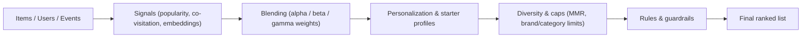

# RecSys Configuration & Data Guide

This document explains *how to think* about configuration rather than listing every environment variable (see `docs/env_reference.md` for the canonical reference). Use it when you need to understand how data ingestion, signals, blending, personalization, rules, and guardrails (defined in `docs/concepts_and_metrics.md`) interact.

> Who should read this? Engineers configuring RecSys via env files, profiles, or overrides—typically when running the stack locally or managing deployments. Hosted API consumers who just need request/response examples can stick to `docs/quickstart_http.md` and `docs/api_reference.md`.

---

## 1. Mental model

```
Ingestion → Signals → Blending → Personalization → Diversity/Caps → Rules → Response
```



_Figure: RecSys pipeline from ingestion through signal building, blending, personalization, and safeguards to the ranked response._

1. **Ingestion:** `/v1/items:upsert`, `/v1/users:upsert`, `/v1/events:batch` populate the catalog and user history. Tag discipline (`brand:`, `category:` prefixes) powers caps and personalization later.
2. **Signals:** Popularity (time-decayed events), co-visitation (proximity in sessions), embeddings (semantic similarity), and optional session heuristics each score every candidate.
3. **Blending:** We normalize signals and mix them with `alpha/beta/gamma` weights. Cold-start presets and segment-specific bundles live in env profiles.
4. **Personalization:** A light tag profile per user boosts overlapping candidates; starter profiles act as scaffolding for cold-start segments.
5. **Diversity & caps:** Maximal Marginal Relevance (MMR; see `docs/concepts_and_metrics.md`) and brand/category caps prevent monotony, enforce coverage guardrails, and apply “exclude purchased” style rules.
6. **Business rules:** Pin/boost/block logic runs last so product curation can override the algorithm when needed.

Every tuning change should state which stage it affects and how to validate the downstream impact.

---

## 2. Configuration layers

- **Environment defaults** — Service-wide per deployment. Set baseline blend weights, windows, guardrails using `.env` files + `make env` (see `docs/env_reference.md`).
- **Env profiles / admin config** — Namespace or segment scope. Capture curated bundles per surface/segment, promote via Git snapshots. Tooling: `analysis/scripts/env_profile_manager.py`, `/v1/admin/recommendation/config`.
- **Per-request overrides** — Single API call scope. Experiment or tailor behavior without redeploying. Use the `overrides` object in `/v1/recommendations` (documented in `docs/api_reference.md`).

Tips:

- Keep env defaults conservative (e.g., moderate diversity, safe `PROFILE_BOOST`). Push “bold” ideas into namespace profiles so you can roll back quickly.
- Use overrides for A/B tests or for clients with dynamic context (e.g., high diversity in “related items” modules but not on the homepage).
- Promote successful overrides back into env profiles to avoid configuration drift.

---

## 3. Wiring ingestion data

1. **Items:** Include `available`, `price`, `tags`, and `props`. Tags drive caps/personalization; embeddings (384 floats) unlock “similar items” quality. Keep `available=false` items out of serving to avoid confusing caps.
2. **Users:** Provide stable IDs plus traits (`segment`, `locale`, `device`, loyalty indicators). Traits feed telemetry and the rule engine.
3. **Events:** Send view/cart/purchase activity with timestamps and surfaces. Time decay uses `POPULARITY_HALFLIFE_DAYS`; co-visitation uses `COVIS_WINDOW_DAYS`. Batch events as soon as possible so personalization has signal.

Quality checklist:

- After seeding or real-time ingestion, call `/v1/items`, `/v1/users`, `/v1/events` to confirm counts.
- Inspect `analysis/evidence/seed_segments.json` or run `analysis/scripts/run_scenarios.py --dump-traces` to verify coverage and personalization evidence.

---

## 4. Tuning surfaces & segments

When you need different behavior across surfaces (Home vs PDP vs Email) or segments (e.g., “power users”), follow these guidelines:

1. **Start from a baseline profile.** Use `analysis/scripts/env_profile_manager.py --namespace <ns> fetch --profile baseline`.
2. **Document intent per surface.** e.g., “Home feed should favor coverage (higher `MMR_LAMBDA`, lower `BRAND_CAP`), PDP similar items can lean on embeddings.”
3. **Adjust small sets of knobs at once.** Blend weights, `MMR_LAMBDA`, `PROFILE_BOOST`, caps, and any bandit settings (contextual bandits are explained in `docs/concepts_and_metrics.md`). Validate on scripted cohorts via the tuning harness (`docs/tuning_playbook.md`).
4. **Capture overrides for clients.** For example, supply `overrides.blend` or `overrides.mmr` based on a surface enum in your application layer.
5. **Promote & snapshot.** Once a configuration wins, commit the JSON profile + evidence artifacts. This keeps code review and audits in sync.

---

## 5. Guardrails & validation

Every config change (env var, profile, or override bundle) should be validated the same way:

> Local stack note: the commands below assume you are running the RecSys stack from this repo. Hosted API consumers can skip them and refer to `docs/quickstart_http.md` for integration-only flows.

1. **Reset namespace + seed** – deterministic dataset ensures comparable metrics.
2. **Run tuning harness** – `analysis/scripts/tuning_harness.py` explores candidate knobs and records evidence under `analysis/results/<namespace_timestamp>/`.
3. **Check guardrails** – `analysis/scripts/check_guardrails.py` enforces YAML policies (starter profile MRR, coverage floors, diversity counts). Review `docs/simulations_and_guardrails.md` for details.
4. **Scenario suite** – `make scenario-suite` replays the full set of guardrail flows (cold start, existing users, rule-heavy cases) and produces CSV/JSON you can share with PMs.
5. **Dry-run rules** – For manual overrides, call `/v1/admin/rules/dry-run` or the helper script before rollout (`docs/rules_runbook.md`).

If a guardrail fails, bias toward tightening the problematic knob rather than widening guardrail tolerances unless you have data to justify the change.

---

## 6. Where to look next

- **Canonical env knobs:** `docs/env_reference.md`
- **Endpoint schemas:** `docs/api_reference.md`
- **Concept & metric definitions:** `docs/concepts_and_metrics.md`
- **Persona-specific lifecycle guidance:** `docs/overview.md`
- **Operational runbook for overrides & incidents:** `docs/rules_runbook.md`

Combine this conceptual map with the quickstart and tuning docs to onboard new teammates without overwhelming them with variable tables.
