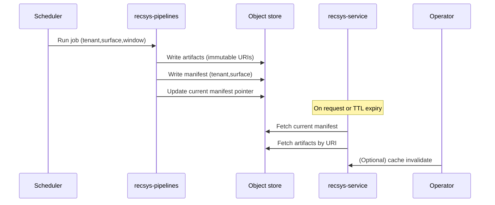

# Artifacts and manifest lifecycle (pipelines → service)
This page explains Artifacts and manifest lifecycle (pipelines → service) and how it fits into the RecSys suite.


## Who this is for

- Developers and platform engineers designing a safe “ship/rollback” process
- SRE/on-call who need a concrete mental model for freshness and rollback incidents
- Data engineers operating `recsys-pipelines`

## What you will get

- What an **artifact** is (and why it should be immutable)
- What the **manifest** is (and why it is the thing you “ship” and “roll back”)
- Where state lives (Postgres vs object store) and what to monitor

## Key terms

- **Artifact**: an immutable, version-addressed blob that contains a computed signal (popularity, co-visitation, etc.).
- **Manifest**: a small JSON document that maps artifact types → artifact URIs for a `(tenant, surface)` pair.
- **“Current” pointer**: the object-store location the service reads as “the current manifest”.

In artifact/manifest mode, you do not “deploy a model” to the service. You deploy a **manifest pointer update**.

## Where things live

In the RecSys suite, state is intentionally split:

- **Postgres**
  - tenants, config, rules
  - item metadata such as `item_tags` (still used in artifact mode)
- **Object store**
  - artifacts (immutable)
  - the “current” manifest pointer (mutable, but small)
- **Logs**
  - exposures and outcomes for evaluation and debugging

## Lifecycle overview

```mermaid
flowchart LR
  C[Client] -->|/v1/recommend| S[recsys-service]
  S --> DB[(Postgres)]
  S -->|load manifest + artifacts| OS[(Object store)]

  E[Interaction events] --> P[recsys-pipelines]
  P -->|publish artifacts (immutable)| OS
  P -->|swap current manifest (pointer)| OS
```

## Publish and reload sequence (pipelines → current manifest → service)



## “Ship” and “rollback” in practice

### Shipping

Shipping in artifact mode means:

1. pipelines publish new artifact versions (new URIs)
2. pipelines update the manifest’s `current{}` map to point at those URIs
3. pipelines write the updated manifest to the “current” pointer location

The service then observes the new manifest after:

- the manifest TTL expires, or
- an operator invalidates caches via an admin endpoint (if enabled and permitted)

### Rolling back

Rollback means restoring the previous manifest content at the “current” pointer location.

Operationally:

- keep a copy of the previous manifest (or write manifests to a versioned path in your CI before updating “current”)
- swapping back is fast because artifacts are immutable and already present in object storage

## What to monitor (minimum)

- **Empty recommendations rate** (per surface): a fast signal that a shipped manifest is missing artifacts or is empty
- **Artifact freshness**: the age of the manifest’s `updated_at` per `(tenant, surface)`
- **Service logs**: look for `artifact manifest loaded` and error logs fetching artifacts

## Read next

- Tutorial (ship + rollback): [production-like run (pipelines → object store → ship/rollback)](../tutorials/production-like-run.md)
- Data modes (DB-only vs artifact/manifest): [Data modes: DB-only vs artifact/manifest](data-modes.md)
- Pipelines rollback guide: [How-to: Roll back to a previous artifact version](../recsys-pipelines/docs/how-to/rollback-manifest.md)
