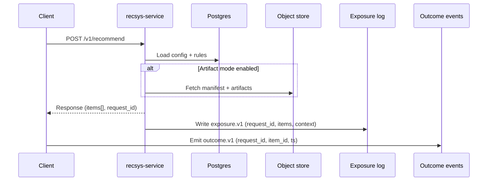

---
tags:
  - explanation
  - evaluation
  - ops
  - developer
  - recsys-service
  - recsys-eval
---

# Exposure logging and attribution

## Who this is for

- Integrators wiring RecSys into a product (webshop, content feed, etc.)
- Recommendation engineers and analysts running `recsys-eval`
- Operators who need to debug “why are metrics wrong?” incidents

## What you will get

- The minimum you must log to measure recommendations
- How to attribute outcomes to exposures safely (joins that work)
- How to configure `recsys-service` to emit eval-compatible exposure logs
- Common logging bugs and the symptoms they cause

## The one rule: log exposures

If you only log clicks/purchases (outcomes) but not “what you showed” (exposures), you cannot evaluate recommendation
quality. Clicks without exposures are not attributable.

Exposure logging is also the foundation for:

- offline regression (quality gates before shipping)
- online experiments (measuring lift)
- incident debugging (“did we serve the wrong config/rules/algo?”)

## End-to-end flow (request → exposure → outcome)



The join key is `request_id`. Your product must carry it from the recommend call to the outcome event.

## What to log (minimum viable)

You need two streams, plus an optional third:

1. **Exposure**: what items you showed and in what order (ranked list)
2. **Outcome**: what the user did (click, conversion, etc.)
3. **Assignment** (optional): what experiment variant this request/user was in

For evaluation, all joins are driven by `request_id`.

### Exposure (recsys-eval: `exposure.v1`)

Required fields:

- `request_id`: join key (stable per recommendation request)
- `user_id`: stable, pseudonymous identifier (do not log raw PII)
- `ts`: RFC3339 timestamp
- `items[]`: array of `{ item_id, rank }` (rank is 1-based)

Strongly recommended context keys:

- `tenant_id`, `surface`, `segment`
- `algo_version`, `config_version`, `rules_version` (for auditability)

Example (JSONL; one object per line):

```json
{"request_id":"req-1","user_id":"u_hash_1","ts":"2026-02-05T10:00:00Z","items":[{"item_id":"item_1","rank":1},{"item_id":"item_2","rank":2}],"context":{"tenant_id":"demo","surface":"home","segment":"default"}}
```

### Outcome (recsys-eval: `outcome.v1`)

Required fields:

- `request_id`: must match the exposure’s `request_id`
- `user_id`: should match the exposure’s `user_id` (recommended for sanity checks and downstream analytics)
- `item_id`: item that was clicked/converted
- `event_type`: `click` or `conversion`
- `ts`: RFC3339 timestamp

Example:

```json
{"request_id":"req-1","user_id":"u_hash_1","item_id":"item_2","event_type":"click","ts":"2026-02-05T10:00:03Z"}
```

### Assignment (recsys-eval: `assignment.v1`, optional)

If you run A/B tests, log assignments so analysis can segment by variant.

Required fields:

- `experiment_id`, `variant`, `request_id`, `user_id`, `ts`

Example:

```json
{"experiment_id":"exp-1","variant":"A","request_id":"req-1","user_id":"u_hash_1","ts":"2026-02-05T10:00:00Z","context":{"tenant_id":"demo","surface":"home"}}
```

See full schemas and examples: [`reference/data-contracts/eval-events.md`](../reference/data-contracts/eval-events.md)

## Getting `request_id` right (attribution correctness)

To attribute outcomes to the right exposure, you need a single `request_id` that flows:

`client request → recsys-service response → outcome event`

You have two common options:

- **Client-supplied request IDs**: set `X-Request-Id` when calling `/v1/recommend`, then reuse that ID in outcome events.
- **Server-generated request IDs**: read `meta.request_id` from the response and attach it to outcome events.

Pick one, implement it consistently, and test joins early with `recsys-eval validate`.

## `recsys-service` exposure logging (built-in)

The service can write exposure logs as JSONL to a file or a directory:

- `EXPOSURE_LOG_ENABLED=true`
- `EXPOSURE_LOG_PATH=/app/tmp/exposures.jsonl` (file) or `/app/tmp/` (directory)
- `EXPOSURE_LOG_RETENTION_DAYS=30` (directory mode rotates and prunes old files)

There are two output formats:

- `service_v1`: service-native exposure event (good for audit/debugging)
- `eval_v1`: `recsys-eval` compatible `exposure.v1` records (recommended for evaluation workflows)

Recommended for evaluation:

```bash
EXPOSURE_LOG_ENABLED=true
EXPOSURE_LOG_FORMAT=eval_v1
EXPOSURE_LOG_PATH=/app/tmp/exposures.eval.jsonl
```

### Privacy: stable pseudonymous IDs

The service logs **hashed** identifiers (HMAC-SHA256) rather than raw user IDs. Set a secret salt so hashes are stable
and non-guessable:

```bash
EXPOSURE_HASH_SALT=change-me-to-a-secret
```

If no user/session identifier is available for eval output, the service falls back to using `request_id` as `user_id` to
keep schemas valid (but this weakens user-level evaluation).

## Common logging bugs (and symptoms)

- **Only outcomes, no exposures**
  - Symptom: you can’t compute offline metrics; experiments are ambiguous.
- **Outcome events missing `request_id`**
  - Symptom: join rate collapses; reports look “too good” or “too bad” randomly.
- **Different `user_id` values in exposures vs outcomes**
  - Symptom: low join rate or joins that only work for some platforms (web vs app).
- **Multiple request IDs per single rendered list**
  - Symptom: duplicates, inconsistent attribution, confusing on-call investigations.
- **Logging raw PII**
  - Symptom: security review blocks adoption; you may breach internal policy.

## Verification checklist (do this early)

- Validate schemas:
  - `recsys-eval validate --schema exposure.v1 --input exposures.jsonl`
  - `recsys-eval validate --schema outcome.v1 --input outcomes.jsonl`
- Compute a basic join rate in your warehouse:
  - `% of exposures with at least one matching outcome by request_id`
- Ensure your top slicing keys exist (at minimum: `tenant_id`, `surface`).

## Read next

- Data contracts hub: [`reference/data-contracts/index.md`](../reference/data-contracts/index.md)
- Event join logic: [`reference/data-contracts/join-logic.md`](../reference/data-contracts/join-logic.md)
- Experimentation model (A/B, interleaving, OPE): [`explanation/experimentation-model.md`](experimentation-model.md)
- Candidate vs ranking: [`explanation/candidate-vs-ranking.md`](candidate-vs-ranking.md)
- Run eval and ship: [`how-to/run-eval-and-ship.md`](../how-to/run-eval-and-ship.md)
