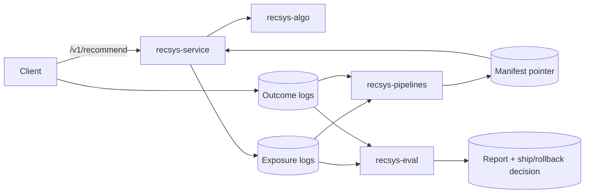

---
tags:
  - explanation
  - architecture
  - overview
  - developer
---

# Suite architecture

## Who this is for

- Lead developers and platform engineers integrating the suite
- Recommendation engineers who want a “whole system” mental model
- SRE / on-call engineers who need to know rollback levers and common failure modes

## What you will get

- The end-to-end data flow from serving → logging → pipelines → evaluation
- Where state lives in each mode (DB-only vs artifact/manifest)
- The IDs that tie everything together (`tenant_id`, `surface`, `request_id`)
- The operational levers for safe shipping and rollback

## One-screen mental model

See also: [`start-here/diagrams/suite-context.md`](../start-here/diagrams/suite-context.md)

## Components and responsibilities

### recsys-service (online)

Responsibilities:

- Low-latency HTTP API (`/v1/recommend`, `/v1/similar`)
- Tenancy and scoping (tenant headers/JWT claims, surfaces, segments)
- Caching and backpressure
- Exposure logging (for evaluation and auditability)

Reads:

- Tenant config/rules (versioned) from Postgres (optional but recommended)
- Signals either:
  - from Postgres tables (DB-only mode), or
  - from artifacts referenced by a manifest pointer (artifact/manifest mode)

Writes:

- Exposure logs (file-based JSONL by default)
- Optional audit logs for admin writes

Start here:

- Admin/bootstrap: [`reference/api/admin.md`](../reference/api/admin.md)
- Config reference: [`reference/config/recsys-service.md`](../reference/config/recsys-service.md)

### recsys-algo (ranking core)

Responsibilities:

- Deterministic ranking/scoring of candidate sets
- Constraints/rules/diversity with explainability support
- Ports-and-adapters design so storage backends can vary

Start here:

- [`recsys-algo`](../recsys-algo/index.md)

### recsys-pipelines (offline artifact builder)

Responsibilities:

- Ingest and canonicalize raw events
- Compute versioned artifacts (e.g., popularity, co-occurrence)
- Publish artifacts and update the “current” pointer (manifest)
- Provide rollback by pointer swap (never point serving at missing blobs)

Start here:

- [`recsys-pipelines/docs/start-here.md`](../recsys-pipelines/docs/start-here.md)
- Artifact lifecycle: [`recsys-pipelines/docs/explanation/artifacts-and-versioning.md`](../recsys-pipelines/docs/explanation/artifacts-and-versioning.md)

### recsys-eval (evaluation + decision support)

Responsibilities:

- Validate logs against strict schemas
- Compute offline regression gates and online experiment analysis
- Produce reports and a decision trail (“ship / hold / rollback”)

Start here:

- Overview: [`recsys-eval/overview.md`](../recsys-eval/overview.md)
- Interpreting results: [`recsys-eval/docs/interpreting_results.md`](../recsys-eval/docs/interpreting_results.md)

## The key identifiers (how the system joins up)

- `tenant_id`: organization boundary for data isolation and config (see `tenants.external_id`)
- `surface`: where recommendations are shown (e.g., `home`, `pdp`); also a signal namespace by default
- `segment`: optional sub-slice within a surface (e.g., `new_users`)
- `request_id`: join key across exposure logs and outcomes; make it stable per request
- `user_id`: stable, pseudonymous identifier (avoid raw PII)

Related:

- Namespacing: [`explanation/surface-namespaces.md`](surface-namespaces.md)
- Logging: [`explanation/exposure-logging-and-attribution.md`](exposure-logging-and-attribution.md)

## Data modes: DB-only vs artifact/manifest

There are two supported serving modes:

- **DB-only mode**: signals live in Postgres tables and are read directly by the service.
- **Artifact/manifest mode**: pipelines publish versioned blobs to object storage and the service reads the current
  versions via a manifest pointer.

This tradeoff is explained here:

- [`explanation/data-modes.md`](data-modes.md)

## Ship and rollback: what changes in production

Common production levers:

1) **Config and rules**

   - Update via admin endpoints (versioned, optimistic concurrency).
   - Invalidate service caches after updates.

   See:

   - [`reference/api/admin.md`](../reference/api/admin.md)

2) **Artifacts / manifest pointer**

   - Pipelines publish new artifacts and swap the manifest pointer last.
   - Rollback is a pointer swap to the last known-good manifest.

   See:

   - Pipelines rollback: [`recsys-pipelines/docs/how-to/rollback-manifest.md`](../recsys-pipelines/docs/how-to/rollback-manifest.md)
   - Suite runbook (service): [`operations/runbooks/rollback-config-rules.md`](../operations/runbooks/rollback-config-rules.md)

## Common failure modes (and where to look)

- **Empty recs**
  - missing signals (DB-only) or missing/incorrect manifest (artifact mode)
  - surface/namespace mismatch (`home` data queried under `pdp`)
  - overly strict constraints/rules

See:

- [`operations/runbooks/empty-recs.md`](../operations/runbooks/empty-recs.md)
- [`explanation/surface-namespaces.md`](surface-namespaces.md)

- **Forbidden / tenant scope errors**
  - tenant headers missing or mismatched

See:

- [`how-to/integrate-recsys-service.md`](../how-to/integrate-recsys-service.md)

## Read next

- Tutorial: [`tutorials/local-end-to-end.md`](../tutorials/local-end-to-end.md)
- How-to: [`how-to/run-eval-and-ship.md`](../how-to/run-eval-and-ship.md)
