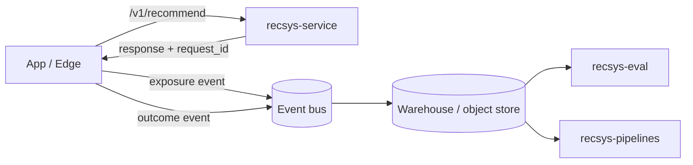

---
tags:
  - how-to
  - integration
  - ops
  - developer
  - recsys-service
---

# Cookbook: integrate with an event bus (streaming)

## Who this is for

Platform engineers publishing exposure/outcome events into Kafka/Kinesis/PubSub and building downstream datasets.

## What you will get

- A minimal architecture for correct attribution with an event bus
- A request_id strategy that survives retries and at-least-once delivery
- Verification checks that catch broken joins early

## Goal

Publish exposure and outcome events to an event bus (Kafka/Kinesis/PubSub) so you can:

- build evaluation datasets reliably
- run `recsys-pipelines` on a schedule or stream
- debug and roll back with a clear audit trail

## Minimal architecture

## Steps

1. **Choose where `request_id` is generated**
   - Client-generated: set `X-Request-Id` on the API call, reuse for outcomes.
   - Server-generated: read `meta.request_id` from the response, reuse for outcomes.

2. **Publish exposure events only after render**
   - Avoid logging prefetches; they destroy attribution quality.

3. **Publish outcomes with the same `request_id`**
   - A retry that creates a new `request_id` is the fastest way to break joins.

4. **Handle duplicates**
   - Most buses are at-least-once. Deduplicate downstream by `(request_id, item_id, event_type, ts)` (or your
     equivalent).

## Verify

- Validate event schemas at the edge (or immediately in your stream processor).
- Monitor join rates and missing fields:
  - outcomes missing `request_id`
  - outcomes missing `item_id`
  - exposures with empty `items[]`

## Pitfalls

- **Out-of-order delivery**
  - Outcomes may arrive before exposures. Design your joins to handle late data.
- **Multi-surface reuse**
  - Do not reuse `request_id` across different surfaces/modules.
- **PII in event payloads**
  - Keep user identity pseudonymous; do not include raw email/phone.

## Read next

- Data contracts hub: [`reference/data-contracts/index.md`](../../reference/data-contracts/index.md)
- Event join logic: [`reference/data-contracts/join-logic.md`](../../reference/data-contracts/join-logic.md)
