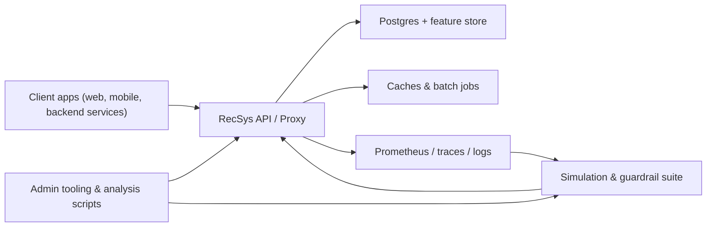

# RecSys Overview (Personas & Lifecycle)

This guide explains RecSys from three vantage points—business stakeholders, integration engineers, and developers. Each section links to deeper docs so you can jump directly into the material relevant to you. **Read the four-step “New here?” path in [`README.md`](../README.md) first** (business overview → narrative → HTTP quickstart → API reference) and then use this overview as a persona map and lifecycle reference.

> **Where this fits:** Architecture & mental model.

## TL;DR

- Use this doc after the README onboarding path to see where each persona fits.
- Business readers get links to value/guardrail docs; engineers get integration, tuning, and ops views.
- You can safely skim for your persona and come back later for the full lifecycle diagram.

> **Who should read this?** Everyone who completed the main onboarding path and now needs a persona-oriented map of the docs. When you see commands referencing `make` or `analysis/scripts`, they assume you cloned the repo; hosted API users can ignore those sections and stick to [`docs/quickstart_http.md`](quickstart_http.md).
> Looking for a full script index? See [`docs/analysis_scripts_reference.md`](analysis_scripts_reference.md).

## Business / Product Stakeholders

**Goal:** Understand the value narrative, rollout plan, and safety controls.

1. **Start here:** [`docs/business_overview.md`](business_overview.md) for the product story and rollout expectations.
2. **Learn the language:** Skim [`docs/concepts_and_metrics.md`](concepts_and_metrics.md) to decode key metrics such as Normalized Discounted Cumulative Gain (NDCG, a ranking quality score), Mean Reciprocal Rank (MRR, “how early good items appear?”), and coverage (how much of the catalog you actually surface), and keep it nearby for guardrail reviews.
   _Local stack note: commands such as `make scenario-suite` assume you cloned the repo; hosted API users can skip them._
3. **Plan guardrail reviews:** Coordinate with engineering on the scenario suite (`make scenario-suite`) and quality evaluations. Expect to hear about starter-profile guardrails (automatic checks that block bad changes before they reach users), coverage (how much of the catalog appears in recommendations), long-tail share (exposure for less popular items), and segment lifts (before/after metric changes)—each defined in [`docs/concepts_and_metrics.md`](concepts_and_metrics.md). For a narrative explanation, see the “What guardrails are (plain language)” section in [`docs/simulations_and_guardrails.md`](simulations_and_guardrails.md).
4. **Campaign overrides:** Merchandising teams use `/v1/admin/rules` & `/v1/admin/manual_overrides`. [`docs/rules_runbook.md`](rules_runbook.md) explains precedence, telemetry, and audit expectations.
5. **Audit & reporting:** Decision traces (`/v1/audit/decisions`) provide “why” evidence for VIP reviews. Business stakeholders should know how to request/export these traces.

## Integration Engineers

**Goal:** Wire ingestion pipelines, manage namespaces, and make simple configuration changes.

1. **Spin up locally:** Follow [`GETTING_STARTED.md`](../GETTING_STARTED.md) for Docker stack + seeding, or [`docs/quickstart_http.md`](quickstart_http.md) if you only need HTTP calls.
2. **Understand payloads:** Use [`docs/api_reference.md`](api_reference.md) for endpoints plus [`docs/database_schema.md`](database_schema.md) for storage quirks.
3. **Configure defaults:** Reference [`docs/env_reference.md`](env_reference.md) when editing `.env`, env profiles, or request-level overrides.
4. **Validate changes:** Run `analysis/scripts/run_simulation.py` and consult [`docs/simulations_and_guardrails.md`](simulations_and_guardrails.md) before pushing config/rule changes.
5. **Admin hygiene:** Reset namespaces with `analysis/scripts/reset_namespace.py`, snapshot configs via `analysis/scripts/recommendation_config.py`, and keep fixtures under version control.

## Developers / Ops

**Goal:** Extend RecSys, tune policies, and support production incidents.

1. **Tuning:** Follow [`docs/tuning_playbook.md`](tuning_playbook.md) for reset → seed → tune → guardrail workflows. The “Tuning run checklist” at the end of that doc is the canonical step-by-step sequence to paste into tickets.
2. **Guardrails & CI:** Use [`docs/simulations_and_guardrails.md`](simulations_and_guardrails.md) plus `guardrails.yml` to automate checks and understand failures.
3. **Rules & overrides:** Operate the rule engine with [`docs/rules_runbook.md`](rules_runbook.md) (pre-deploy dry-runs, telemetry, rollback steps).
4. **Telemetry & audits:** Monitor Prometheus metrics (coverage, guardrail failures, rule exposure) and query `rec_decisions` to explain incidents.

## Quick Links

- **Local + HTTP quickstarts** — [`GETTING_STARTED.md`](../GETTING_STARTED.md), [`docs/quickstart_http.md`](quickstart_http.md).
- **API behavior & schemas** — [`docs/api_reference.md`](api_reference.md), Swagger at `/docs`, [`docs/database_schema.md`](database_schema.md).
- **Configuration knobs** — [`docs/configuration.md`](configuration.md) (concepts), [`docs/env_reference.md`](env_reference.md) (canonical list).
- **Guardrails & simulations** — [`docs/simulations_and_guardrails.md`](simulations_and_guardrails.md), `analysis/scripts/run_simulation.py`, `guardrails.yml`.
- **Rules & ops** — [`docs/rules_runbook.md`](rules_runbook.md), Prometheus dashboards.
- **Tuning workflow** — [`docs/tuning_playbook.md`](tuning_playbook.md), `analysis/scripts/tuning_harness.py`.

Keep this overview handy when onboarding new teammates or explaining RecSys to
external partners—it shows where each persona should dive deeper.

Need a day-by-day ramp-up? See [`docs/onboarding_checklist.md`](onboarding_checklist.md).

_Figure: High-level RecSys architecture showing clients, API, storage, tooling, and observability loops._

## Lifecycle Checklist

1. **Seed data** – Load items/users/events (`analysis/scripts/seed_dataset.py` or ingestion APIs). Confirm via `/v1/items|users|events` and `analysis/evidence/seed_segments.json`. See [`GETTING_STARTED.md`](../GETTING_STARTED.md) for the step-by-step.
2. **Configure env/profile** – Adjust `.env` or namespace profiles, referencing [`docs/configuration.md`](configuration.md) + [`docs/env_reference.md`](env_reference.md). Apply via `analysis/scripts/configure_env.py` or `env_profile_manager.py`.
3. **Tune & explore** – Run `analysis/scripts/tuning_harness.py` following [`docs/tuning_playbook.md`](tuning_playbook.md) to explore blend/MMR/personalization settings per segment/surface.
4. **Run simulations & guardrails** – Execute `analysis/scripts/run_simulation.py` (or `make scenario-suite`) and review bundles under `analysis/reports/<customer>/<timestamp>/`. Guardrail guidance lives in `docs/simulations_and_guardrails.md`.
5. **Deploy / Update rules** – Use `/v1/admin/rules` & `/v1/admin/manual_overrides`. Follow `docs/rules_runbook.md` for dry-run, telemetry, and rollback instructions.
6. **Monitor & audit** – Watch Prometheus dashboards, log guardrail failures, and query decision traces via `/v1/audit/decisions` or the `rec_decisions` table. Loop back to Step 3 whenever catalogs, knobs, or overrides change.

---

## Where to go next

- If you’re integrating HTTP calls → see `docs/quickstart_http.md`.
- If you’re a PM → skim `docs/business_overview.md`.
- If you’re tuning quality → read `docs/tuning_playbook.md`.
