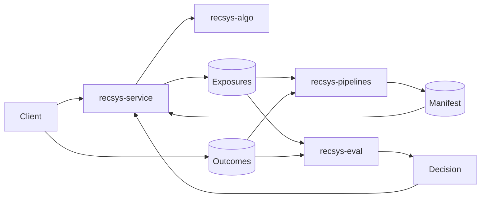

# Suite Context

```mermaid
flowchart LR
  C[Client] --> S[recsys-service]
  S --> A[recsys-algo]
  S --> E[(Exposures)]
  C --> O[(Outcomes)]
  E --> P[recsys-pipelines]
  O --> P
  P --> M[(Manifest)]
  M --> S
  E --> V[recsys-eval]
  O --> V
  V --> D[Decision]
  D --> S
```
